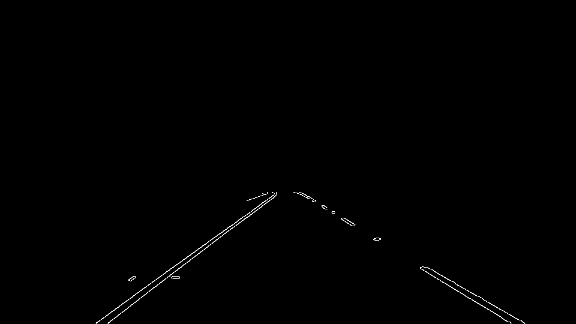
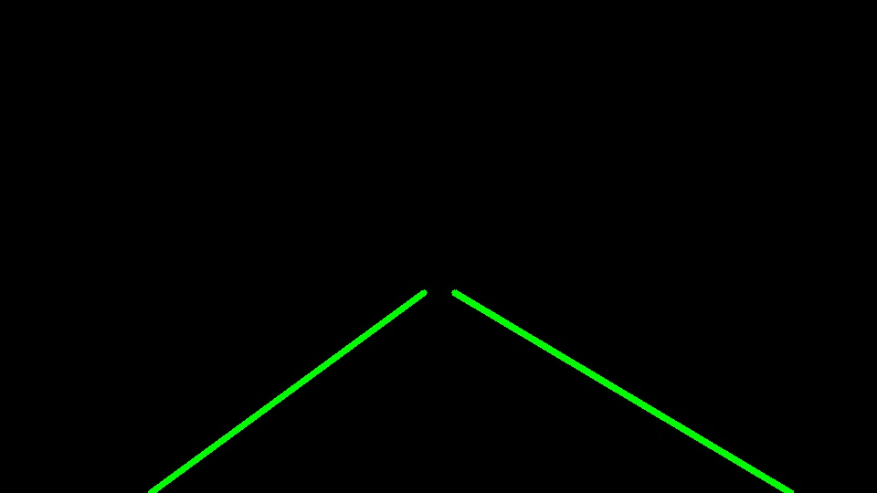
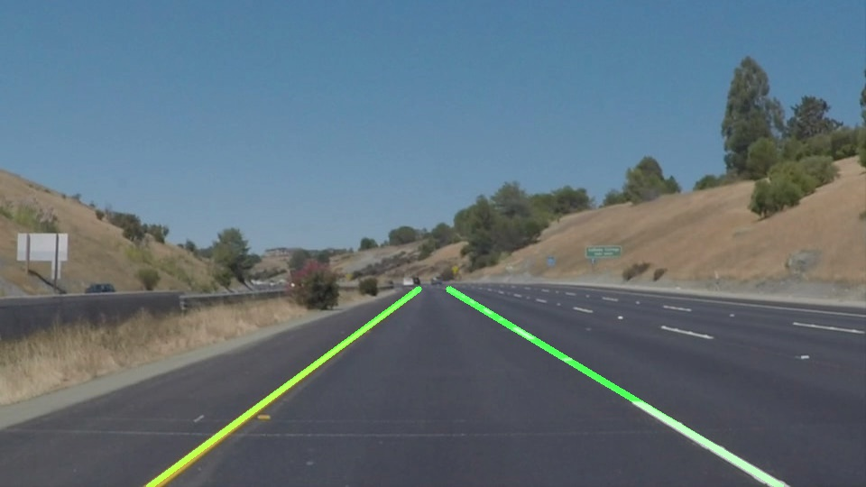

**Finding Lane Lines on the Road**


### 1. Pipeline

**Step 1: Convert image to grayscale**

The first step in the pipeline is converting the image to grayscale so that each pixel is represented by a scalar value so that we can calculate the gradient across the image


**Step 2: Apply gaussian blur to image**

Next, we apply a gaussian blur to the image (with a kernel=5) to help filter out small color changes in the image, which might otherwise result in a noisy gradient and output of the canny filter


**Step 3: Apply Canny Filter**

The canny filter works by taking the gradient of the image and applying thresholding to identify regions of the image where the grayscale intensity if changing quickly, which is often caused by features of interest in the image, like cars, trees, lane markings, etc


**Step 4: Mask the image**

Next, we mask the image so that we only consider the lower-center region of the image, where we expect the lane markings to occur.

**

**Step 5: Identify and mark the left and right lane markings**

Finally, we can use the greatly simplified image above to identify the left and right lane markings. See the section below for more detail



**Step 6: Overlay**

We overlay the output from step 5 onto the original image in order to produce our final result. In the image below, the blue markings represent the markings identified as part of the left lane marking, and the red markings are those identified as beloning to the right lane marking. The green lines are the final left/right markings for the lane position


### 2. Lane Identification

The final lane markings were drawn from the raw Hough line inputs by ...
1. Filtering based on slope
2. Averaging using weighted average based on line length

```
INPUT: Hough-Lines (x1,y1,x2,xy)
OUTPUT: Left/Right lane markings as Image

# Filter input lines by slope
left_lines = []
right_lines = []
For line in lines:
  Calculate line slope: m
  If m is between -40 deg <-> -20 deg:
    Append line to left_lines
  Else if m is between 20 deg <-> 40 deg:
    Append line to right lines
    
for line in left_lines:
  Calculate slope m and intercept b
  Calculate line segment length L
Average all m,b across left_lines using weights (L)
 
# Computer same values for right lines

# Given final m_avg,b_avg for left and right lines, draw on image
 
 ```

### 3. Identify potential shortcomings with your current pipeline

- In situtations where the pavement changes color (like in the challenge video), the canny filter seems to fail to identify the lane markings
- The final lane markings are not as smooth/stable as they could be
- The identification is sensitive to other cars
- The linear model for a lane is over-simplified and would not handle sharp turns well

### 4. Suggest possible improvements to your pipeline

- Smoothing out the identified model parameters by averaging between frames
- Using a RANSAC to fit the line from the Hough identified lines, which would have better outlier rejection
- Using a quadratic/spine model instead of linear to better handle curving roads

### 5. Results

[solidWhiteRight.mp4](test_videos_output/solidWhiteRight.mp4)

[solidYellowLeft.mp4](test_videos_output/solidYellowLeft.mp4)


